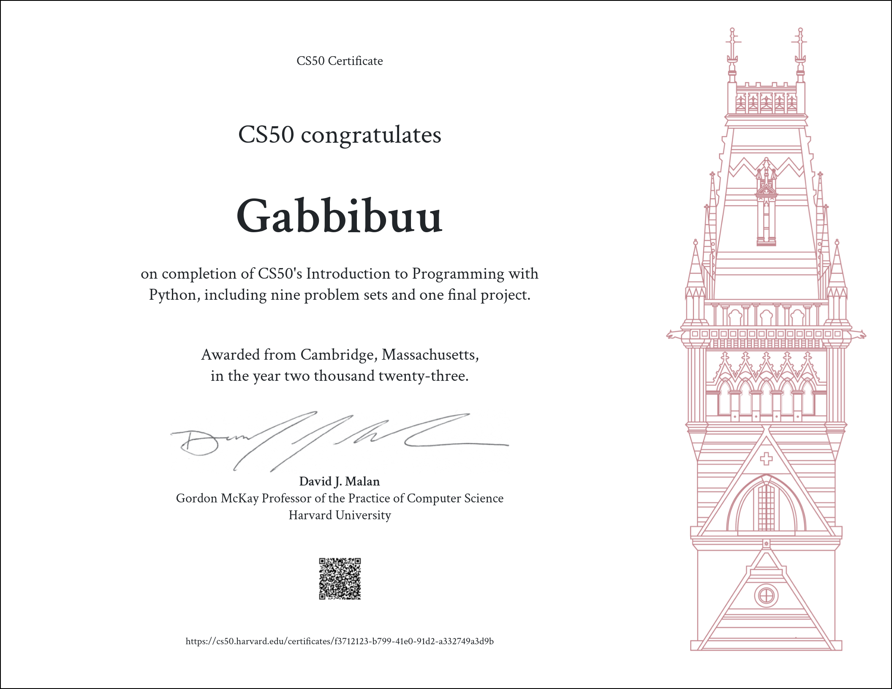

# CS50’s Introduction to Programming with Python

Here are my solutions for CS50's Introduction to Programming with Python 2023.

__❗The following codes are for educational purpose only and not intended to be submitted as your own.__

## Table of Contents
### [Problem Set 0](/problem_set_0/) - [Functions, Variables](https://cs50.harvard.edu/python/2022/weeks/0/)
- [Indoor Voice](/problem_set_0/indoor.py)
- [Playback Speed](/problem_set_0/playback.py)
- [Making Faces](/problem_set_0/faces.py)
- [Einstein](/problem_set_0/einstein.py)
- [Tip Calculator](/problem_set_0/tip.py)

### [Problem Set 1](/problem_set_1/) - [Conditionals](https://cs50.harvard.edu/python/2022/weeks/1/)
- [Deep Thought](/problem_set_1/deep.py)
- [Home Federal Savings Bank](/problem_set_1/bank.py)
- [File Extensions](/problem_set_1/extensions.py)
- [Math Interpreter](/problem_set_1/interpreter.py)
- [Meal Time](/problem_set_1/meal.py)

### [Problem Set 2](/problem_set_2/) - [Loops](https://cs50.harvard.edu/python/2022/weeks/2/)
- [camelCase](/problem_set_2/camel.py)
- [Coke Machine](/problem_set_2/coke.py)
- [Just setting up my twttr](/problem_set_2/twttr.py)
- [Vanity Plates](/problem_set_2/plates.py)
- [Nutrition Facts](/problem_set_2/nutrition.py)

### [Problem Set 3](/problem_set_3/) - [Exceptions](https://cs50.harvard.edu/python/2022/weeks/3/)
- [Fuel Gauge](/problem_set_3/fuel.py)
- [Felipe's Taqueria](/problem_set_3/taqueria.py)
- [Grocery List](/problem_set_3/grocery.py)
- [Outdated](/problem_set_3/outdated.py)

### [Problem Set 4](/problem_set_4/) - [Libraries](https://cs50.harvard.edu/python/2022/weeks/4/)
- [Emojize](/problem_set_4/emojize.py)
- [Frank, Ian and Glen's Letters](/problem_set_4/figlet.py)
- [Adieu, Adieu](/problem_set_4/adieu.py)
- [Guessing Game](/problem_set_4/game.py)
- [Little Professor](/problem_set_4/professor.py)
- [Bitcoin Price Index](/problem_set_4/bitcoin.py)

### [Problem Set 5](/problem_set_5/) - [Unit Tests](https://cs50.harvard.edu/python/2022/weeks/5/)
- [Testing my twttr](/problem_set_5/test_twttr/)
- [Back to the Bank](/problem_set_5/test_bank/)
- [Re-requesting a Vanity Plate](/problem_set_5/test_plates/)
- [Refueling](/problem_set_5/test_fuel/)

### [Problem Set 6](/problem_set_6/) - [File I/O](https://cs50.harvard.edu/python/2022/weeks/6/)
- [Lines of Code](/problem_set_6/lines/)
- [Pizza Py](/problem_set_6/pizza/)
- [Scourgify](/problem_set_6/scourgify/)
- [CS50 P-Shirt](/problem_set_6/shirt/)

### [Problem Set 7](/problem_set_7/) - [Regular Expressions](https://cs50.harvard.edu/python/2022/weeks/7/)
- [NUMB3RS](/problem_set_7/numb3rs/)
- [Watch on YouTube](/problem_set_7/watch/)
- [Working 9 to 5](/problem_set_7/working/)
- [Regular, um, Expressions](/problem_set_7/um/)
- [Response Validation](/problem_set_7/response/)

### [Problem Set 8](/problem_set_8/) - [Object-Oriented Programming](https://cs50.harvard.edu/python/2022/weeks/8)
- [Seasons of Love](/problem_set_8/seasons/)
- [Cookie Jar](/problem_set_8/jar/)
- [CS50 Shirtificate](/problem_set_8/shirtificate/)

## Final Project: [Pomodoro Timer](https://github.com/Gabbibuu/Pomodoro-Timer)
